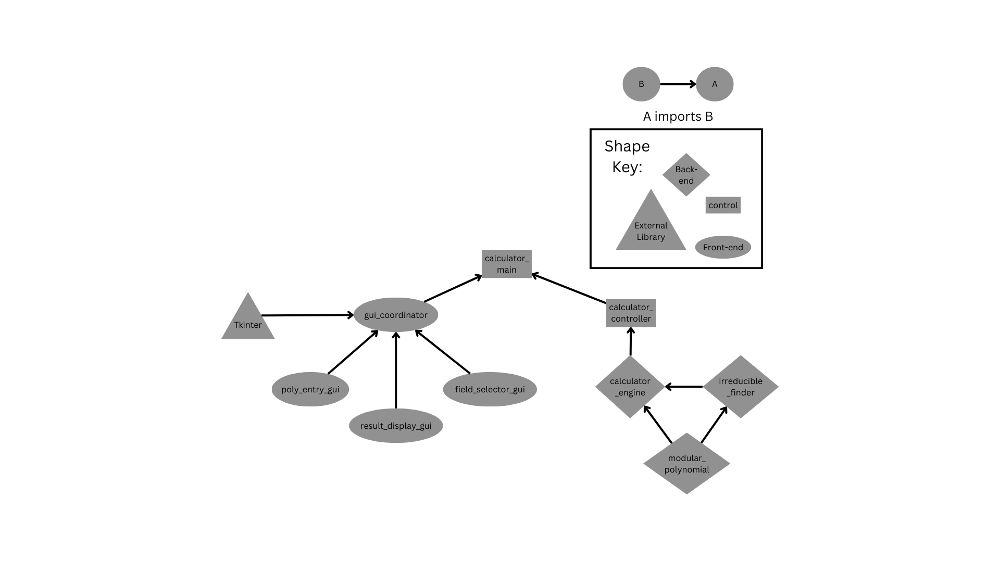

# Finite Field Calculator

## What the Program Is

The Finite Field Calculator is a desktop application that allows users to perform arithmetic operations in finite fields of the form GF(p^n), where p is a prime number and n is a positive integer. Key features include:

- Support for finite field extensions up to GF(p^12) with p ≤ 101
- Polynomial representation of field elements
- Basic arithmetic operations: addition, subtraction, multiplication, and division
- Automatic generation of irreducible polynomials for field construction
- Interactive graphical user interface for field selection and polynomial entry
- Real-time calculation results

The calculator implements a novel approach to irreducibility testing that optimizes performance while maintaining mathematical correctness. This makes it both an educational tool for exploring finite field properties and a practical utility for performing calculations in these mathematical structures.

## Purpose of the Program

### Technical Portfolio Demonstration

The primary purpose of this calculator is as a portfolio project, this calculator demonstrates:

- Implementation of non-trivial mathematical algorithms
- Creation of a clean, modular software architecture
- Development of a responsive GUI application
- Novel optimization of established mathematical tests
- Thorough documentation of both code and mathematical concepts

### Educational Value

The secondary purpose of this calculator is educational, serving as an interactive tool for:

- Students learning abstract algebra and finite field theory
- Instructors demonstrating field arithmetic operations visually
- Researchers exploring properties of finite fields
- Anyone interested in understanding the mathematical structures that underpin modern cryptography and coding theory

By providing a hands-on way to work with finite fields, the calculator bridges the gap between abstract mathematical concepts and concrete arithmetic operations.

### Practical Applications

While primarily demonstrative, the calculator also has practical applications in:

- **Cryptography**: Understanding operations in GF(2^8) used in AES encryption
- **Coding Theory**: Exploring the mathematics behind Reed-Solomon codes
- **Algorithm Development**: Testing mathematical operations for implementations in these domains

## Brief Overview of Code Architecture

The Finite Field Calculator follows a modular architecture that separates the user interface, control logic, and mathematical operations:

### Core Components

**Main Entry Point**: `calculator_main`
- Creates controller and coordinator instances
- Initializes the application

**GUI Coordinator**: `gui_coordinator`
- Orchestrates all GUI components
- Manages user interactions and delegates calculations to the controller
- Handles state changes and updates the interface

**Calculator Controller**: `calculator_controller`
- Bridges between GUI and mathematical engine
- Manages field initialization and calculation requests
- Handles asynchronous operations

### GUI Components

**Field Selector**: `field_selector_gui`
- Allows users to specify p and n for GF(p^n)
- Displays the irreducible polynomial modulus
- Manages field activation state

**Polynomial Entry**: `poly_entry_gui`
- Provides coefficient entry fields for two polynomials
- Offers operation selection (add, subtract, multiply, divide)
- Adjusts dynamically to the selected field size

**Result Display**: `result_display_gui`
- Shows calculation results in a clear format

### Mathematical Engine

**Calculator Engine**: `calculator_engine`
- Implements the `FiniteFieldCalculator` class
- Handles field-specific arithmetic operations
- Manages the irreducible polynomial modulus

**Irreducible Finder**: `irreducible_finder`
- Generates irreducible polynomials using a modified Rabin's test
- Implements optimized algorithms for testing irreducibility
- Provides the foundation for finite field construction

**Modular Polynomial**: `modular_polynomial`
- Implements fundamental operations for polynomials in modular arithmetic
- Provides core functionality used by higher-level components

The architecture uses a callback mechanism for communication between components, allowing for loose coupling and flexibility. For more detailed information on the implementation, see the [Code Architecture Documentation](./Docs/Code Architecture.md).

## Mathematical Background

### Core Mathematical Concepts
The calculator relies heavily on the following fundamental concepts:

- [Rabin's Test for Irreducibility](https://en.wikipedia.org/wiki/Factorization_of_polynomials_over_finite_fields#Rabin's_test_of_irreducibility): Modifed version used for finding polynomial modulus for field extention.

- [Polynomial Long Division](https://en.wikipedia.org/wiki/Polynomial_long_division): Used extensively for reduction modulo the field's irreducible polynomial.

- [Modular Exponentiation](https://en.wikipedia.org/wiki/Modular_exponentiation): Required for efficiently computing large powers required for checking if a polynomial is irreducible.

- [Extended Euclidean Algorithm](https://en.wikipedia.org/wiki/Extended_Euclidean_algorithm): Applied to polynomials to find multiplicative inverses in the field.

- [Euler's Theorem](https://en.wikipedia.org/wiki/Euler%27s_theorem): Used to find multiplicative inverses of elements in the base field F_p via the relation a^(-1) ≡ a^(p-2) (mod p).

### Supporting Mathematical Concepts
Additional mathematical ideas employed in the implementation:

- [Horner's Method](https://en.wikipedia.org/wiki/Horner%27s_method): An efficient algorithm for evaluating polynomials at specific values.

- [Primitive Elements](https://en.wikipedia.org/wiki/Primitive_element_(finite_field)): Primitive Elements of the base field F_p are used in the construction of irreducible polynomials.

- [Polynomial Irreducibility Tests](https://en.wikipedia.org/wiki/Irreducible_polynomial#Irreducibility_tests): Specifically, the root-based test for quadratic and cubic polynomials over finite fields.
  
